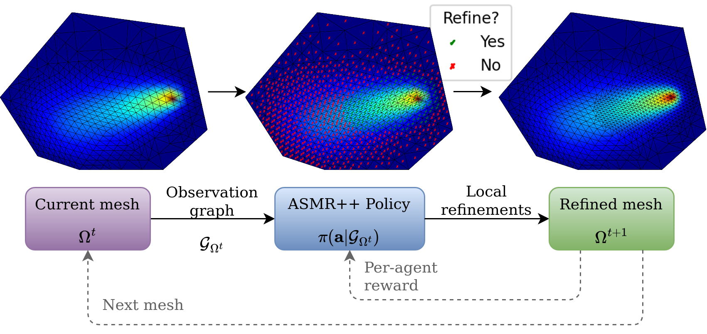

# Adaptive Swarm Mesh Refinement (ASMR++)

## Abstract
Simulating physical systems is a crucial aspect in most engineering disciplines.
As analytical solutions of such simulations are only available for simple cases, numerical methods such as the Finite Element Method (FEM) have become the de-facto standard simulation tool.
However, the FEM generally scales poorly with the complexity of the underlying physics and the desired accuracy of the solution, quickly yielding prohibitively costly simulations.
Adaptive Mesh Refinement (AMR) enhances the FEM by dynamically allocating resources to important parts of the simulated domain, enabling a favorable trade-off between computational speed and simulation accuracy.
Classical AMR methods depend on heuristics or expensive error estimators, limiting their use for complex simulations.
While learning-based AMR methods show promise in tackling these issues, they currently only scale to simple problems. 
In this work, we formulate AMR as a system of collaborating, homogeneous agents that communicate via Message Passing Networks and may iteratively split into multiple new agents.
This per-agent view of AMR allows for a spatial reward formulation, facilitating efficient and stable optimization.
We evaluate our approach, Adaptive Swarm Mesh Refinement++ (ASMR++), on a suite of challenging refinement tasks.
Our approach outperforms learned baselines and heuristics and achieves a refinement quality that is on par with costly error-based oracle AMR strategies.
ASMR++ additionally generalizes to different domains during inference, and produces meshes that simulate up to $2$ orders of magnitude faster than uniform refinements in more demanding settings.

## Schematic


# Getting Started

This code is an extension of [ASMR](https://github.com/NiklasFreymuth/ASMR)

## Setting up the environment

This project uses [conda](https://docs.conda.io/en/latest/) (or better yet, [mamba](https://github.com/conda-forge/miniforge#mambaforge))
and pip for handling packages and dependencies.

You should be able to install all requirements using the commands below:

```
# for cpu use
mamba env create -f ./env/environment-cpu.yaml
mamba activate ASMR_cpu

# for gpu use
mamba env create -f ./env/environment-cuda.yaml
mamba activate ASMR_cuda

# dont forget to login into wandb
wandb login
```


# Experiments

## Tests
Test if everything works by running the test experiments, which will test all methods and tasks 
for a single simplified training episode:

```bash
python main.py configs/asmr/tests.yaml -o
```

## Examples
We give examples for environment generation and the general training interface in `example.py`. Here,
ASMR++ is trained on the Poisson equation using the PPO algorithm.

## Provided Experiments
We provide all experiments used in the paper in the `configs/asmr` folder. The experiments are organized by task.
For example, `configs/asmr/poisson.yaml` contains all Poisson experiments. ASMR++ can be trained on this task via the
provided `poisson_asmr` config by executing `python main.py configs/poisson.yaml -e poisson_asmr -o`

## Creating and running experiments

Experiments are configured and distributed via cw2 (https://www.github.com/ALRhub/cw2.git).
For this, the folder `configs` contains a number of `.yaml` files that describe the configuration of the task to run. 
The configs are composed of individual
_experiments_, each of which is separated by three dashes and uniquely identified with an `$EXPERIMENT_NAME$`.

To run an experiment from any of these files on a local machine, type
`python main.py configs/$FILE_NAME$.yaml -e $EXPERIMENT_NAME$ -o`.

To start an experiment on a cluster that uses [Slurm](https://slurm.schedmd.com/documentation.html), run
`python main.py configs/$FILE_NAME$.yaml -e $EXPERIMENT_NAME$ -o -s --nocodecopy`.

Running an experiments provides a (potentially nested) config dictionary to main.py.
For more information on how to use this, refer to the cw2 docs.

# Project Structure

## Reports

After running the first experiment, a folder `reports` will be created.
This folder contains everything that the loggers pick up, organized by the name of the experiment and the repetition.

## Source

The `src` folder contains the source code for the algorithms. It is organized into the following subfolders:

### Algorithms
This folder includes all the iterative training algorithms, that are used by [cw2](https://www.github.com/ALRhub/cw2).
The `rl` directory implements common Reinforcement Learning algorithms, such as `PPO` and `DQN`.

### Recording

We provide a logger for all console outputs, different scalar metrics and task-dependent visualizations per iteration.
The scalar metrics may optionally be logged to the [wandb dashboard](https://wandb.ai).
The metrics and plot that are recorded depend on both the task and the algorithm being run.
The loggers can (and should) be extended
to suite your individual needs, e.g., by plotting additional metrics or animations whenever necessary.

All locally recorded entities are saved the `reports` directory, where they are organized by their experiment and repetition.

## Util

Common utilities used by the entire source-code can be found here. 
This includes additions torch code, common definitions and functions, and save and load functionality.

## ASMR Evaluations

The folder `asmr_evaluations` contains the code for the evaluation of the ASMR algorithm and all baselines. It uses
checkpoint files from the training of the algorithms and evaluates them on the separate evaluation PDE.

## Modules

### SwarmEnvironments
The environments include a `Mesh Refinement` and a `Sweep Mesh Refinement` environment.
Both deal with geometric graphs of varying size that represent meshes over a fixed boundary 
and are used for the finite element method.

### HMPN
Building blocks for the Message Passing Network architecture.

# Citation
Please cite this code and the corresponding paper as
```
@article{freymuth2024swarm,
  title={Adaptive Swarm Mesh Refinement},
  author={Freymuth, Niklas and Dahlinger, Philipp and W{\"u}rth, Tobias and Reisch, Simon and K{\"a}rger, Luise and Neumann, Gerhard},
  journal={Under Review at Journal of Machine Learning Research}
  year={2024}
}
```
